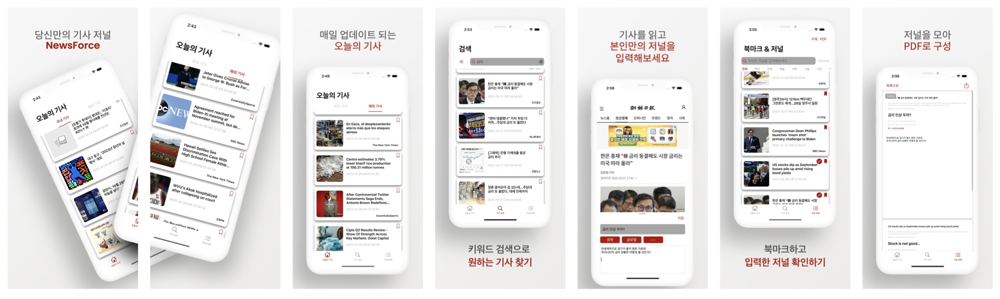

# NewsForce



#### 원하는 기사를 북마크로 저장하고, 기사를 읽으며 저널을 작성하고, 작성한 저널을 PDF 문서로 추출해서 활용할 수 있는 앱입니다.

# Link

[NewsForce 앱스토어 링크](https://apps.apple.com/app/newsforce/id6469046867)

[블로그: 개발 과정에 따른 자세한 회고](https://velog.io/@simonyain/NewsForce-출시-회고)

# 개발 기간 및 인원
- 2023.09.25 ~ 2023.10.31
- 배포 이후 지속적 업데이트 중 (현재 version 1.2.1)
- 최소 버전: iOS 15.0
- 1인 개발

# 사용 기술
- **UIKit, LinkPresentation, PDFKit, WebKit, SPM, Push Notifications Console**
- **Alamofire, Realm, Kingfisher, RxSwift, SnapKit, JDStatusBarNotification, SkeletonView, Tabman, FirebaseAnalyticsWithoutAdid, FirebaseCrashlytics, FirebaseMessaging**
- **MVVM, Router, Singleton, Repository, DTO Data Structure**
- **CompositionalLayout, DiffableDatasource, ListContentConfiguration, UISheetPresentation, UISearchBar + ContainerView, BaseView + Custom ReusableView**
- **NotificationCenter, GCD, UserDefaults, FileManager, NSCache, Codable, Hashable**
- **API: Naver News API, Media Stack API, News API**

------

# 기능 구현

- 서로 다른 API 데이터를 통합 관리하기 위한 DTO 구조 설계
  - 앱 내부에서는 DTO 구조만 가지고 데이터 다룸
  - API 구조 변경 시, DTO 구조로 변경하는 지점만 수정하는 유지 보수 비용 이점 확보 
- `Realm` DB Table 스키마 구성
    - `EmbeddedObject` 활용한 Subset Pattern 
    - 최근 검색어 및 검색 횟수를 DB 스키마로 관리, 유저 검색 활동 UX 개선
- `DiffableDataSource`를 활용한 data 기반 CollectionView 핸들링
    -  Realm DB 실시간 특성 활용, snapshot update 시나리오 구성
- `UISheetPresentation` 및 custom Detent 활용, 기사 탐독에 방해되지 않을 높이의 화면 전환 구성
    - identifier 및 높이값 설정으로 custom 높이의 detent 구성 (최소 버전: iOS 16)
    - iOS 15는 어쩔 수 없이 `.medium()`이 최소
- 기사의 Image Fetch 위한 네트워크 통신 횟수 감소와 데이터 구성 속도 개선
  - `FileManager` 활용한 이미지 디스크 캐싱
  - `NSCache` 활용한 `LPLinkMetadata` 메모리 캐싱
- `PDFKit` 기반 PDF 문서 구성 및 `ActivityViewController` 활용 파일 공유 및 저장 기능 구현
    - PDF 문서 구성에 활용될 요소들이 차지할 영역을 계산, 상단 (0,0)부터 시작해 문서 크기를 다 채우기 전까지 요소를 그려나감
    - 문서 가로 길이를 초과하는지 분기 처리, 그려질 `CGRect`의 높이를 더 크게 설정
    - 입력한 저널 내용을 일정 크기의 `UITextView`로 나눠서 생성, 각 textView가 남은 페이지 양을 초과해 다음 페이지에서 그려져야 하는 지 분기처리해서 그려지도록 함
- 기사 fetch 과정에서 UI적으로 상황 알려줌으로 유저의 UX 경험 개선
    - `SkeletonView`를 활용해 기사와 이미지를 로딩중임을 알림
    - 기사 결과가 없을 경우 CollectionView의 emptyView 활용해 fetch해올 수 없는 상황 인지시켜줌 UX 개선
- `FCM` 및 `Push Notifications Console` 활용 remote Push 기능 구현

------

# Trouble Shooting

### A. UISheetPresentation 활용 시, 유저의 drag down에 따라 입력한 값을 따로 저장하지 않으면 활용 불가능

`UISheetPresentation`으로 화면전환되는 ViewController도 결국 화면에서 내려가면 메모리에서 해제된다. 
해제되기 전에 저널 입력값들을 저장해야, 새로 fetch하지 않았다는 가정하에 동일 기사에서 임시 저장된 입력값들을 활용할 수 있었다.
해결을 위해 SheetPresentation이 화면에서 내려갈 시점에 입력값이 존재하면 `UserDefaults`에 저장하도록 코드 구성을 했다.

```swift
//MemoViewModel
func saveTempTitleToUserDefaults(_ title: String) throws {
    if let id = objectId, let journal = repository.fetchSingleRecord(objectId: id) {
        if !userDefault.saveToUserDefaults(newValue: title, forKey: journal.title ) {
            throw UserDefaultsError.cannotSaveTempTitleForJournal
        }
    } else {
        guard let news = news else { return }
        if !userDefault.saveToUserDefaults(newValue: title, forKey: news.title) {
            throw UserDefaultsError.cannotSaveTempTitleForNews
        }
    }
}
    
func saveTempMemoToUserDefaults(_ text: String) throws {
    if let id = objectId {
    //from Journal
        if !userDefault.saveToUserDefaults(newValue: text, forKey: "\(id)") {
        //수정 임시 메모 저장 실패 알림
            throw UserDefaultsError.cannotSaveTempMemoForJournal
        }
    } else {
    //from News
        guard let news = news else { return }
        if !userDefault.saveToUserDefaults(newValue: text, forKey: news.id) {
            //임시 메모 저장 실패 알림
            throw UserDefaultsError.cannotSaveTempMemoForNews
        }
    }
}

//MemoViewController
override func viewDidDisappear(_ animated: Bool) {
    super.viewDidDisappear(animated)
        
    //제목 입력값 존재: 임시 저장
    if let text = titleTextField.text, !text.isEmpty {
      do {
        try self.memoVM.saveTempTitleToUserDefaults(text)
      } catch {
        memoVM.memoErrorMessage.value = MemoSetupValues.savingTempTitleFailed
      }
    }
        
    //memo 입력값 존재: 임시 저장
    if let text = contentTextView.text, !text.isEmpty, !MemoSetupValues.textViewPlaceholders.contains(text) {
      do {
        try self.memoVM.saveTempMemoToUserDefaults(text)
      } catch {
        memoVM.memoErrorMessage.value = MemoSetupValues.savingTempMemoFailed
      }
    }
        
    //backbutton 활성화하기 알림
    NotificationCenter.default.post(name: .memoClosed, object: nil)
}
```

-----

### B. LinkPresentation만으로 기사 이미지를 fetch 해올 경우 오래걸리는 처리 속도

`LinkPresentation`만으로 `LPLinkMetadata`를 활용한 cell을 구성했을 때는 개발 입장에서는 큰 고민이 없었지만 유저가 기사를 새로 가져올 때마다 매번 네트워크 통신이 필요해서 반응이 느려진다는 단점이 나타났다.
따라서 기사의 이미지 파일과 LPLinkMetadata를 캐싱해서 네트워크 요청을 줄여 반응성 높은 앱 디자인이 되도록 했다.
이미지 저장 및 cell 구성 시나리오는 다음과 같았다.

1. `FileManager`를 활용, 디스크에 해당 이미지 파일이 존재하면 fetch해서 cell에 띄워주기
2. 존재하지 않을 경우 DTONews 구조에서 imageUrl string value가 존재하면 `Kingfisher` library 활용, 이미지 파일 imageView에 나타내고 디스크에 저장하기
3. image 링크가 존재하지 않으면 메모리에 캐싱된 `LPLinkMetadata`가 존재하는지 확인
  - a. metadata가 존재하면 LinkPresentation의 `itemProvider`를 활용해서 이미지를 가져오기, 가져올 수 없다면 default image asset을 활용하기
  - b. metadata가 존재하지 않으면 기사 link에서 LPLinkMetadata를 가져오기 (메서드: `startFetch`)
4. metadata fetch에 성공하면 3-a)를 다시 시도, fetch조차 할 수 없다면 default image asset을 활용하기

```swift
private func populateWithPassedData(news: DTONews) {
    //1. Disk에 image 존재 확인
    if let imageData = newsLinkPresentationVM.checkImageInDocuments(), let image = UIImage(data: imageData) {
        setupLinkView(news: news, image: image)
        return
    }
        
    //2. news에서 imagelink 존재 시 kingfisher 활용 이미지 가져오기
    if let imageURL = news.imageURL, let url = URL(string: imageURL) {
        newsImageView.kf.setImage(with: url) { _ in
        	  //디스크에 이미지 저장하기
            guard let image = self.newsImageView.image else { return }
            self.newsLinkPresentationVM.saveImageIntoDocuments(image: image)
                return
        }
    }

    //3. 존재하지 않으면 cache에 metadata 존재 체크
    if let metaData = newsLinkPresentationVM.checkMetadataInMemoryCache() {
        //4-1. 존재하면 loadObject로 image 받아오기
        newsLinkPresentationVM.retrieveImageFromLink(metaData: metaData) { image in
            if let image = image {
            //5-1. image 저장하고 cell 나타내기
                self.newsLinkPresentationVM.saveImageIntoDocuments(image: image)
                    self.setupLinkView(news: news, image: image)
            } else {
                self.setupInvalidLinkPresentation(news: news)
            }
        }
    } else {
        //4-2. 존재하지 않으면 startFetch하기
        newsLinkPresentationVM.fetchMediaNewsMetaData(url: news.urlLink) { result in
            switch result {
                case .success(let data):
                    //5-2-1. metaData 존재: memoryCache에 metadata 저장
                	  self.newsLinkPresentationVM.saveMetadataIntoMemory(data: data)
                    //6-2-1. loadObject로 image 받아오기
                    self.newsLinkPresentationVM.retrieveImageFromLink(metaData: data) { image in
                        if let image = image {
                        //7-2-1. image 저장하고 cell 나타내기
                            self.newsLinkPresentationVM.saveImageIntoDocuments(image: image)
                            self.setupLinkView(news: news, image: image)
                        } else {
                            self.setupInvalidLinkPresentation(news: news)
                        }
                    }
                case .failure(_):
                    //5-2-2. metaData 존재 X: default 이미지로 cell 구성하기
                    self.setupInvalidLinkPresentation(news: news)
                }
            }
        }
    }
```

-----

### C. allowsMultipleSelection으로 구현한 collectionView item 선택 문제
PDF 문서 구성 혹은 아이템 삭제를 위해 여러 item을 선택할 수 있도록 `allowsMultipleSelection`이 true인 상황을 설정했다.
`didSelectItemAt`과 `didDeselectItemAt` 메서드는 allowsMultipleSelection이 false일 때는 하나의 item이 선택될 때 자동으로 다른 item들의 `isSelected` property를 false로 설정한다.
반면 allowsMultipleSelection이 true일 때는 자동으로 update되지 않았다.

allowsMultipleSelection이 true인 상황에서 isSelected의 값이 어떤지에 따라 선택할지, 해제할지를 결정하는 data flow 시나리오는 다음과 같다.
  - didSelect가 호출될 시점: isSelected = true인 상황
    - 선택하고 싶은 item이 isSelected = true이면 데이터 목록에 추가
    - 해제하려는 item이 isSelected = true이면 데이터 목록에서 제거
  - didDeselect가 호출될 시점: isSelected = false인 상황
    - 선택하고 싶은 item이 isSelected = false이면 데이터 목록에 추가
    - 해제하려는 item이 isSelected = false이면 데이터 목록에서 제거

```swift
func collectionView(_ collectionView: UICollectionView, didSelectItemAt indexPath: IndexPath) {
    guard let item = diffableDataSource.itemIdentifier(for: indexPath) else {
        //선택할 수 없음 알리기
        showAlert(title: JournalRealmSetupValues.journalSelectionFailure, message: JournalRealmSetupValues.noJournalToBeSelected)
        return
    }
        
    let cell = journalCollectionView.cellForItem(at: indexPath) as! BookMarkedNewsCell
        
    if collectionView.allowsMultipleSelection {
        if cell.isSelected {
            journalVM.insertSelectedJournal(indexPath: indexPath, selected: item)
            toggleJournalCheckMark(indexPath: indexPath)
        } else {
            if journalVM.removeSelectedJournal(indexPath: indexPath, selected: item) {
                toggleJournalCheckMark(indexPath: indexPath)
            } else {
                journalVM.realmErrorMessage.value = JournalRealmSetupValues.noJournalToBeDeselected
            }
        }
    }
}

func collectionView(_ collectionView: UICollectionView, didDeselectItemAt indexPath: IndexPath) {
    if collectionView.allowsMultipleSelection {
        guard let item = diffableDataSource.itemIdentifier(for: indexPath) else {
            //선택 해제할 수 없음 알리기
            showAlert(title: "", message: JournalRealmSetupValues.noJournalToBeDeselected)
            return
        }
       
        let cell = journalCollectionView.cellForItem(at: indexPath) as! BookMarkedNewsCell
            
        if !cell.isSelected {
            journalVM.insertSelectedJournal(indexPath: indexPath, selected: item)
            toggleJournalCheckMark(indexPath: indexPath)
        } else {
            if journalVM.removeSelectedJournal(indexPath: indexPath, selected: item) {
                toggleJournalCheckMark(indexPath: indexPath)
            } else {
                journalVM.realmErrorMessage.value = JournalRealmSetupValues.noJournalToBeDeselected
            }
        }
}    
```

------

### D. Realm의 record 삭제 후 DiffableDatasource로 snapshot update 시 런타임 에러 발생
Realm DB는 실시간 DB로, 어느 ViewController 혹은 ViewModel에서 record를 삭제했다면 별다른 update 작업 없이도 다른 ViewModel이나 ViewController에서 확인 시, 삭제되었음을 알 수 있다.
그렇기에 삭제된 record로 접근하려는 시도는 런타임 에러가 발생하도록 Realm의 설계가 되어있다.

`DiffableDatasource`는 update 시점에 이전과 이후의 data를 `snapshot`으로 비교해서 변화 지점에 대한 애니메이션과 cell update를 수행한다.
DiffableDatasource에서 data로 Realm의 record를 활용할 경우, snapshot update 이전에 미리 Realm의 record를 제거하면 snapshot 비교 과정에서 런타임 에러가 발생한다.

따라서 record 삭제 이전에 해당 record를 제외한 `Results<RealmDataStructure>`를 fetch해서 snapshot update를 먼저 수행한 뒤, record를 삭제하면 문제없이 활용이 가능하다.

```swift
@objc private func bookmarkButtonTapped(sender: CustomBookMarkButton) {
    guard let indexPath = sender.indexPath, let item = diffableDataSource.itemIdentifier(for: indexPath) else {
        journalVM.realmErrorMessage.value = DefaultHomeViewSetupValues.notAbleToTapBookMarkButton
        return
    }
        
    //Journal 존재 여부 확인하기
    if item.journal != nil {
        //alert로 작동: 삭제를 다시 한 번 확인
        self.alertForRealmDeletion(title: NewsSearchSetupValues.bookmarkedRealmDeletionTitle, message: NewsSearchSetupValues.bookmarkedRealmDeletionMessage, bookMarked: item)
    } else {
        //해당 BookMarkedNews 제외한 data로 snapshot update하기
        self.journalVM.updateSnapshotBeforeUnBookMark(bookMarked: item)
    
        //제거 전에 먼저 Notification 주기: collectionview update 먼저
        switch item.apiType {
            case .naver:
                NotificationCenter.default.post(name: .realmDeletedInJournalVCSourceFromNaver, object: nil, userInfo: [NotificationUserInfoName.realmBookMarkedNewsLinkToBeDeleted: [item.link]])
            case .mediaStack:
                NotificationCenter.default.post(name: .realmDeletedInJournalVCSourceFromMediaStack, object: nil, userInfo: [NotificationUserInfoName.realmBookMarkedNewsLinkToBeDeleted: [item.link]])
            case .newsAPI:
                NotificationCenter.default.post(name: .realmDeletedInJournalVCSourceFromNewsAPI, object: nil, userInfo: [NotificationUserInfoName.realmBookMarkedNewsLinkToBeDeleted: [item.link]])
            }

            //해당 item 실제로 Realm에서 제거하기
            journalVM.removeBookMarkedNewsFromRealm(bookMarkedNews: item)
        }
}
```

------

# 회고

- Realm의 데이터 구조도 DTO로 레이어를 하나 더 구현해서 Realm으로 저장하거나, 삭제할 때만 Realm의 record type으로 변환해서 DiffableDatasource의 snapshot update 시점을 고민하지 않아도 되도록 설정하는 것이 나은 구조라고 생각이 들었다.
  차후 업데이트로 데이터 처리와 비즈니스 로직 처리 구분을 더 명확하게 해야할 것이다.

- 공수 산정 설정하는 데에 UI 디테일 설정이 예상보다 더 오래 걸렸다. UI 디자인 구성에 더 신경쓰고 타사 앱들은 어떻게 만들었는지, 왜 이렇게 동작하는 지에 대한 고민을 하면서 참고해야 할 것이다.


